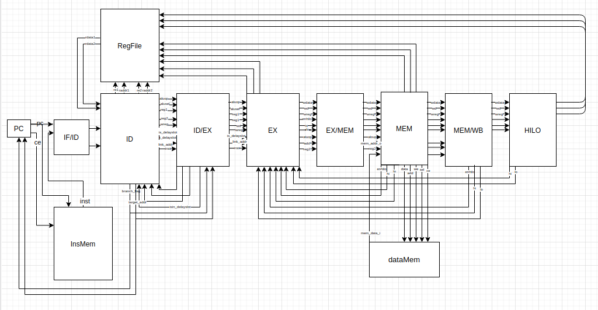

 

# BIT_CPU
北京理工大学2017级计算机小学期（体系结构和编译原理）
## Environment
+ Vivado2019.2 https://china.xlinx.com/support/download.hrml
## Resource
+ https://github.com/hongshen424/single_cpu_design
+ https://github.com/bit-mips/bitmips_experiments
+ <自己动手写cpu> 雷思磊

## Code 
+ /exp_results: some results of simulation.
+ /init: the coe init file used to program into the device(artix-7).
+ /mips: the mips assemble code for test of different instructions.
+ /test: .data machine code corresponding to the .asm file in /mips.

## Program to the device
+ Change the dataMem and the instMem to IP(ROMS & RAMS) provided by vivado and provide .coe file instead of .data file.
+ Remove the testbench at the synthesis and implementation stage.

+ Simulation
+ Synthiesis
+ I/O Ports and other constraints which you can learn more in /init/teach_soc
+ Generate Bitstream
+ Program

## Conclusion
+ 屈子曰：路漫漫其修远兮，吾将上下而求索。此言甚是，余定谨记而遵行之。
